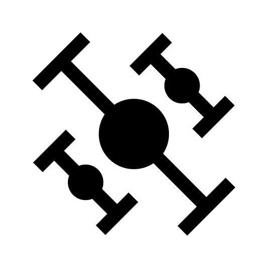

# Smooth Operator

#### Smooth Operator is a RoboFont extension for diagnosing all angle/ratio discrepancies between interpolable UFOs. It basically helps prevent kinks in your curves.

It was written on top of code from [Angle Ratio Tool](https://github.com/LettError/angleRatioTool) by Letterror/Erik van Blokland, and it is intended for use in conjunction with Angle Ratio Tool.

## Sample workflow:
- Get your type family to a place where it is actually interpolable/"Prepolated" (same start points, contour order, contour direction, etc.)
- Run Angle Ratio Checker in order to view problem-points, ranked by priority: low-quality angle/ratio (most likely to cause kinks in your interpolation) to high-quality (fairly synced angles and/or ratios across all sources).
- Work your way down the rows to bring you to the glyphs in question, and use Angle Ratio Tool to manually address the issue, using your judgment based on your design.

## UI

### Source UFOs
These are the UFOs that will be checked/scanned. They could be already-open UFOs (Add Open UFOs button), or they don’t have to be open at the time of scanning.

### Settings

##### Tolerance
When the difference in angles or difference in ratios across UFOs exceed this amount, they will be evaluated and not automatically considered 100% quality. The default is `1` Angle and `0.3` Ratio.

##### Check Points
Choose the type of points you'd like to analyze. Only points with a `smooth` flagged will be checked. Triangle points are smooth points with only one off-curve. Circle points are smooth points with two off-curves.

### Results
This is the output of the tool, allowing you to see which specific points might cause issues in your interpolation. When you click on a row, all open glyph windows will not only go to the that glyph, but the point-of-interest will be marked with a red star.

##### Indexes
Using these buttons, you can globally control the display settings of all open glyph windows, either showing or hiding all labels for contour or point indexes.
